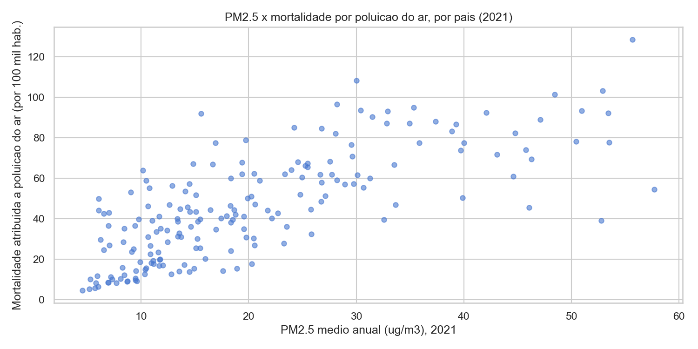
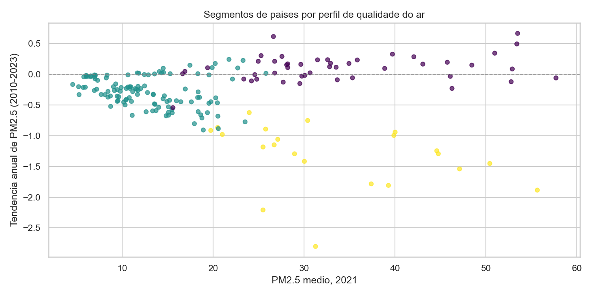

# Relatório Final: Monitor de Qualidade do Ar e Saúde Pública

## Contexto

Dado real da OMS (WHO Global Health Observatory): PM2.5 médio anual por país (2010-2023, 227 países) e taxa de mortalidade atribuída à poluição do ar ambiente (2021, 192 países).

## 1. Correlação entre PM2.5 e Mortalidade

Regressão linear simples entre PM2.5 e a taxa de mortalidade atribuída à poluição do ar, para o ano de 2021 (185 países com os dois indicadores disponíveis).

- R2: 0,553
- p-valor: menor que 0,001

PM2.5 explica boa parte da variação de mortalidade entre países, mas não tudo, o que é esperado: a mortalidade também depende de acesso a saúde, idade da população e outros fatores ambientais.

## 2. Tendência de PM2.5 (2010-2023)

Regressão linear por país (PM2.5 em função do ano), com pelo menos 8 anos de dado disponível (227 países).

**Maior melhora:**
- China: -2,80 μg/m³/ano
- Coreia do Norte: -2,21 μg/m³/ano
- Afeganistão: -1,88 μg/m³/ano

**Maior piora:**
- Nigéria: +0,67 μg/m³/ano
- Guiné Equatorial: +0,62 μg/m³/ano
- Camarões: +0,49 μg/m³/ano

A melhora da China é um resultado bem documentado, ligado a políticas ambientais fortes na última década. A piora em países da África Ocidental acompanha o crescimento urbano acelerado da região.

## 3. Segmentação de Países (K-Means)

Segmentei países por PM2.5 médio, mortalidade e tendência, com K escolhido por silhouette score (K=3).

Os segmentos separam países com ar limpo e estável, países com ar ruim mas melhorando, e países com ar ruim e piorando. Essa última categoria é a prioridade de política pública.

## 4. Mapa Interativo

Mapa coroplético de PM2.5 por país em `reports/figures/mapa_pm25.html`, gerado com Folium.

## Conclusão

Os resultados confirmam, com dado real, uma relação clara entre poluição do ar e mortalidade, e mostram que a trajetória de melhora ou piora varia muito entre países. Isso serve de base pra priorizar onde uma política de qualidade do ar teria mais impacto.
